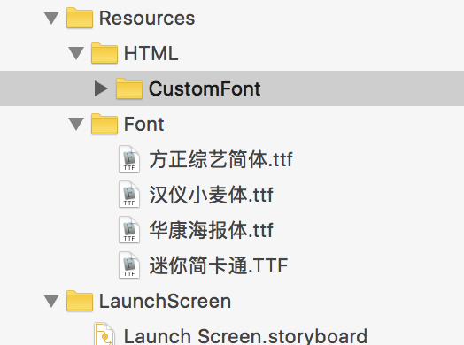

## iOS添加第三方字体

  iOS添加第三方字体库分四步完成：

- 1.将字体库添加到XCode项目中去

- 2.在info.plist文件中添加`Fonts provided by application`字段，然后将字体库的名字写入字段下的数组内。

- 3.最重要的一步，打开Xcode的项目配置文件，选中BuildPhases，展开Copy Bundle Resources，点击下面的“+”号，把字体库文件加入进来。。

- 4.程序中使用的时候用，字体的真名（双击字体看标题)

- 5.常用字体下载

 [方正综艺简体](Fonts/方正综艺简体.ttf) 
 [汉仪小麦体](Fonts/汉仪小麦体.ttf) 
 [华康海报体](Fonts/华康海报体.ttf) 
 [迷你简卡通](Fonts/迷你简卡通.ttf)